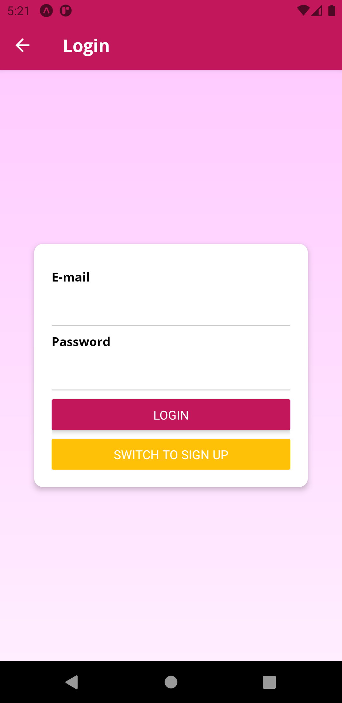
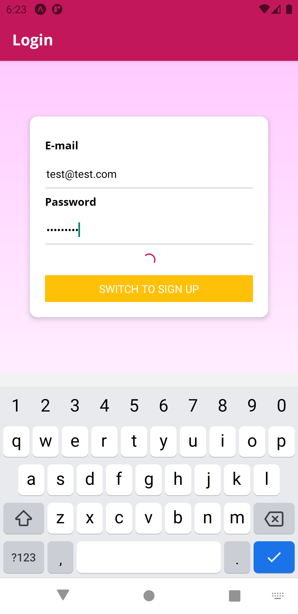
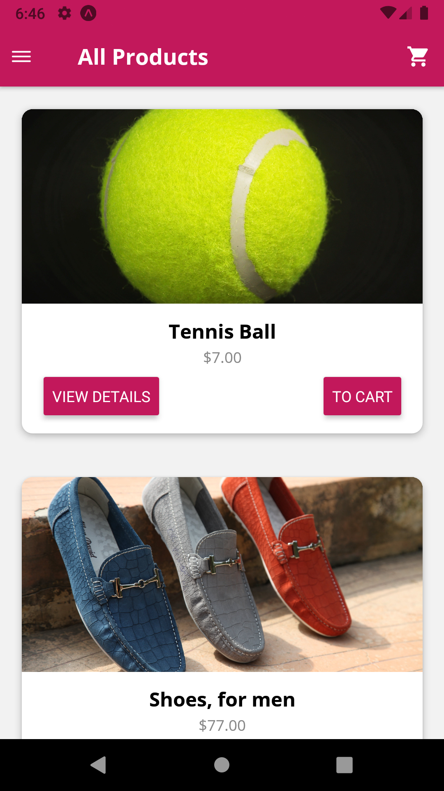
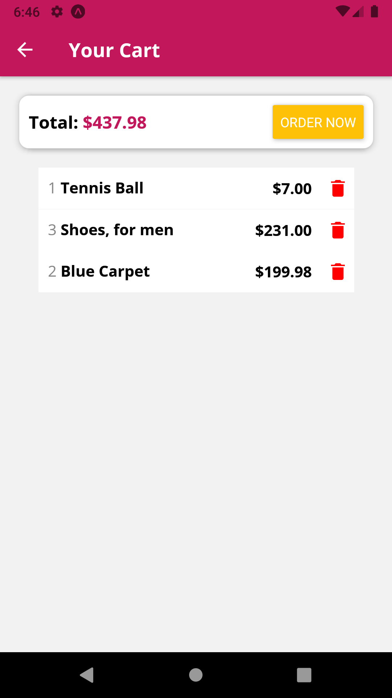
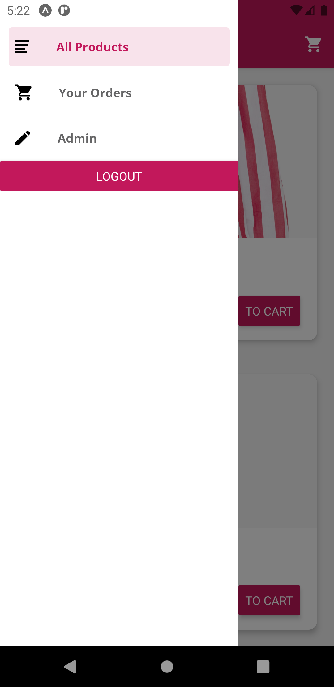
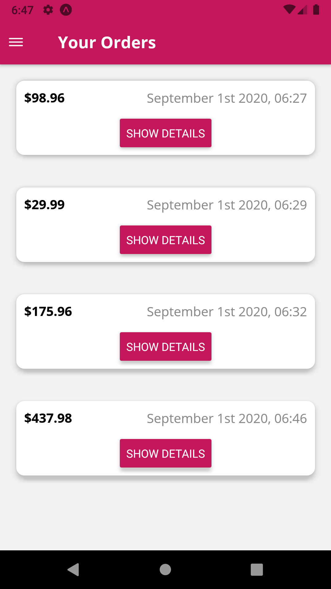
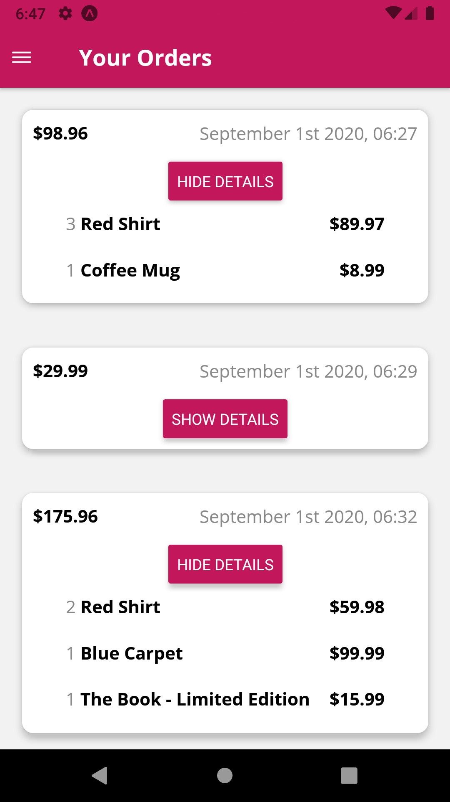
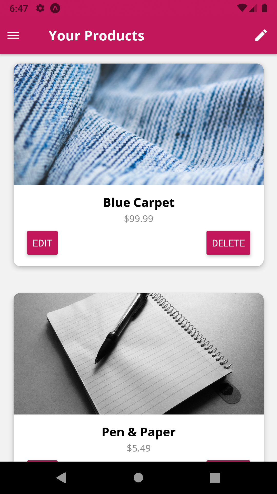
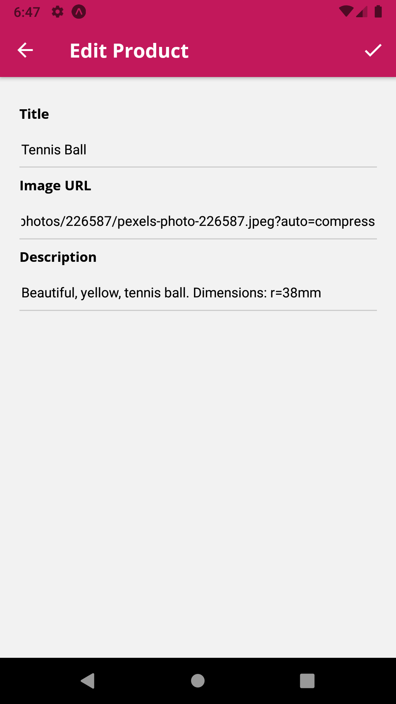
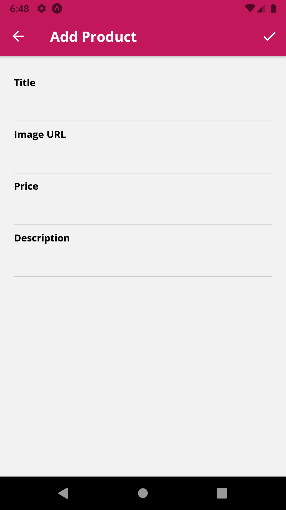

# App Screenshots

<div style="display: flex;">












</div>

# Installations

- expo init rn_shop_app
- npm install redux react-redux
- npm install @react-navigation/native
- npm install react-navigation-header-buttons
- expo install react-native-gesture-handler react-native-reanimated react-native-screens react-native-safe-area-context @react-native-community/masked-view
- npm install @react-navigation/stack
- ...
- npm i expo-linear-gradient

> All stackNavigators should be connected with drawerNavigator. And this drawerNavigator needs to be exported as default.

> Each first/default screen in stackNavigators should have a "headerLeft" menu icon for opening drawer menu.

# Usage of UseSelector Hook (from react-redux npm library)

```
const data = useSelector(state => state.partOfState.subPartOfState)
const data = useSelector(state => state.partOfState.subPartOfState.find(...))
```

- partOfState: should be checked from generally App.js. In this app it could be one of the options (products, cart or orders), because in App.js:

```
const rootReducer = combineReducers({
  products: productsReducer,
  cart: cartReducer,
  orders: ordersReducer,
});
```

- subPartOfState: should be looked to reducer files and "initialState" definitions. For example, if partOfState: cart, then subPartOfState could be items or totalAmount, because, in /reducers/cart.js:

```
const initialState = {
  items: {},
  totalAmount: 0,
};
```

# Creating handler functions and registering them to "route" (by using useCallback & useEffect) and using them from navigation buttons (from other components)

> Here is the EditPage.js

```
  //THIS IS MIRACLE!
  //Define a function here (related to the data inside this page) and then using "useEffect" register this function to the route (add params of the route)
  //and then, this function accessible by the another screen/component (ShopNavigator) by using route.params['function']()

  const submitHandler = useCallback(() => {
    console.log('Submitting!');
    //YOU CAN DISPATCH A FUNCTION HERE (YOU CAN DO WHATEVER YOU WANT)
  }, []);

  useEffect(() => {
    props.navigation.setParams({ submit: submitHandler });
  }, [submitHandler]);
```

> Here is the MainNavigation.js (where the save button on the right top)

```
<StackAdmin.Screen
  name="EditProduct"
  component={EditProductScreen}
  options={({ navigation, route }) => ({
    headerTitle:
      route.params && route.params.productId
        ? 'Edit Product'
        : 'Add Product',
    headerRight: () => (
      <HeaderButtons HeaderButtonComponent={HeaderButton}>
        <Item
          title="Save"
          iconName={
            Platform.OS === 'android' ? 'md-checkmark' : 'ios-checkmark'
          }
          onPress={() => {
            route.params['submit'](); //VERY CRITICAL TACTIC!
          }}
        />
      </HeaderButtons>
    ),
  })}
/>
```

# Usage of re-usable template Components (just for styling)

> Normal way of styling in a component...

```
const Card = (props) => {
  return <View style={styles.card}>{props.children}</View>;
};
```

> This is styling with default style("card" in this example) and additional extra props if exist...
> This is merging default styles with props

```
const Card = (props) => {
  return <View style={{ ...styles.card, ...props.style }}>{props.children}</View>;
};
```

> When calling from other component: default "card" styles combined with "product" styles.

```
<Card style={styles.product}>
```

# useReducer (for merging multiple states together)

Now if you have that many states that are kind of connected, you also can do this in a more elegant way, instead of having your separate states for each input, you can have one big state which merges all input values and which merges all validities and then use a concept called a reducer, not a Redux reducer but one supported by React out the box to manage that state.

You do this with the use reducer hook which again has nothing to do with Redux, the concept of a reducer is not Redux exclusive, a reducer in the end is just a function that takes input and spits out some output and therefore React also supports this.

So what's the idea of a reducer? Now first it's important to understand that useReducer is a hook that helps you have state management. Typically you use it if you have connected states or more complex state and you don't want have a bunch of individual use state calls and a bunch of individual states which you
manage. You then can use useReducer.

Reducer function should be able to change that state when actions are dispatched and an action should be dispatched whatever we type into one of our text inputs, that will be the trigger. So therefore, we can now get rid of all these state assignments (all elements kept in state like: const [title, setTitle] = useState('')) and hence we can also get rid of the entire use state import even and make sure we dispatch the reducer update action for every keystroke we do in an input.

```
  //WITH THE USE OF useReducer, NO NEED TO USE THESE SEPARATE STATE ASSIGNMENTS
  //const [title, setTitle] = useState('');
  //const [imageUrl, setImageUrl] = useState('');
  //const [price, setPrice] = useState('');
  //const [description, setDescription] = useState('');

  //const [state, dispatch] = useReducer(reducer, initialState, init)
    useReducer(formReducer, {
    inputValues: {
      title: '',
      imageUrl: '',
      description: '',
      price: '',
    },
    inputValidities: {
      title: true,
      imageUrl: true,
      description: true,
      price: true,
    },
    formIsValid: true,
  });
```

> Summarized usage of using react reducer for merging multiple states together in a form with multiple inputs (You can check detailed usage in the /screens/user/EditProductScreen.js or /screens/user/AuthScreen.js)

```
import React, { useReducer } from 'react';

...

const formActions = {
  FORM_INPUT_UPDATE: 'FORM_INPUT_UPDATE',
  ANOTHER_ACTION: 'ANOTHER_ACTION',
};

...

const formReducer = (state, action) => {
  if (action.type === formActions.FORM_INPUT_UPDATE) {
    const updatedValues = {
      ...state.inputValues,
      [action.input]: action.value,
    };
    const updatedValidities = {
      ...state.inputValidities,
      [action.input]: action.isValid,
    };
    let updatedFormIsValid = true;
    for (const key in updatedValidities) {
      updatedFormIsValid = updatedFormIsValid && updatedValidities[key];
    }
    return {
      inputValues: updatedValues,
      inputValidities: updatedValidities,
      formIsValid: updatedFormIsValid,
    };
  } else if (action.type === formActions.ANOTHER_ACTION) {
    ...
    return updatedState;
  }
  return state; //if another action happens
};

...

const XXXScreen = (props) => {
  //const [state, dispatch] = useReducer(reducer, initialState, init)
  const [formState, dispatchFormState] = useReducer(formReducer, {
    inputValues: {
      title: editedProduct ? editedProduct.title : '',
      imageUrl: editedProduct ? editedProduct.imageUrl : '',
      description: editedProduct ? editedProduct.description : '',
      price: '',
    },
    inputValidities: {
      title: editedProduct ? true : false,
      imageUrl: editedProduct ? true : false,
      description: editedProduct ? true : false,
      price: editedProduct ? true : false,
    },
    formIsValid: editedProduct ? true : false,
  });


...

  const textChangeHandler = (inputIdentifier, text) => {
    let isValid = false;
    if (text.trim().length > 0) {
      isValid: true;
    }
    //...much much more validity checks can be done here
    dispatchFormState({
      type: formActions.FORM_INPUT_UPDATE,
      value: text,
      isValid: isValid,
      input: inputIdentifier,
    });
  };

...

  return (
    <ScrollView>
      <View style={styles.form}>
        <View style={styles.formControl}>
          <Text style={styles.label}>Title</Text>
          <TextInput
            style={styles.input}
            value={formState.inputValues.title}
            onChangeText={() => textChangeHandler('title')}
            autoCapitalize="sentences"
            autoCorrect
            returnKeyType="next"
          />
          {!formState.inputValidities.title && (
            <Text>Please enter a valid title!</Text>
          )}
        </View>
        <View style={styles.formControl}>
          <Text style={styles.label}>Image URL</Text>
          <TextInput
            style={styles.input}
            value={formState.inputValues.imageUrl}
            onChangeText={() => textChangeHandler('imageUrl')}
          />
        </View>
...
        ...other_text_inputs
      </View>
    </ScrollView>
  );
};

//JUST A SIDE NOTE: For each TextInput and other components wrapping it, like View; and are alongside with it, like Text (for label or validation error message, an "Input" template could be used. (check /components/UI/Input.js)

```

# MORE INFO : How the React Hook useReducer Works

https://dev.to/dtroyano86/how-react-s-usereducer-works-2cjj

# How to Build a Form in React with useReducer

https://dev.to/dtroyano86/how-to-build-a-form-in-react-with-usereducer-3o3a

https://itnext.io/handling-complex-form-state-using-react-hooks-45370515e47

# using Firebase as a API provider and doing all CRUD ops as if there is a back-end server between your app and DB

> Normally direct connection from an app to DB is not secure. And you need to connect/call APIs from a back-end server, and this back-end server should connect to DB as secure as possible.

> But thanks to Firabase DB; it provides us to connect and execute all DB ops as it is back-end server, via "fetch".

> No need to develop back-end/server app!!! (Of course, this is okay for only simple apps or testing somethings quickly)

```
//the code below, inserts a document (row) to the "products" collection (table)
//if "products" not exist, then creates it first !!!
//SIDE-NOTE: ".json" must be appended

const response = await fetch(
  'https://your-app-5b06a.firebaseio.com/products.json/',
  {
    method: 'POST',
    headers: {
      'Content-Type': 'application/json',
    },
    body: JSON.stringify({
      title,
      description,
      imageUrl,
      price,
    }),
  }
);

const resData = await response.json();

console.log(resData);
//do whatever you want with the resData
//normally its just a key, like below
/*
  Object {
    "name": "-MGBcxfaehm00Snvmnkl",
  }
*/
```

# How to use .env vars in React Native app

> Install https://github.com/goatandsheep/react-native-dotenv

> Change your babel.config.js as below:

```
module.exports = function (api) {
  api.cache(true);
  return {
    presets: ['module:babel-preset-expo'],
    plugins: [
      [
        'module:react-native-dotenv',
        {
          moduleName: '@env',
          path: '.env',
          blacklist: null,
          whitelist: null,
          safe: false,
          allowUndefined: true,
        },
      ],
    ],
  };
};

```

> put your keys into .env file and keep it in your root folder

```
FIREBASE_API_KEY=loremipsum
ANOTHER_KEY=loremipsum
```

> Use them by importing: (check /screens/user/AuthScreen.js)

```
import { FIREBASE_API_KEY } from '@env';
...
<Text>{FIREBASE_API_KEY}</Text>

```
